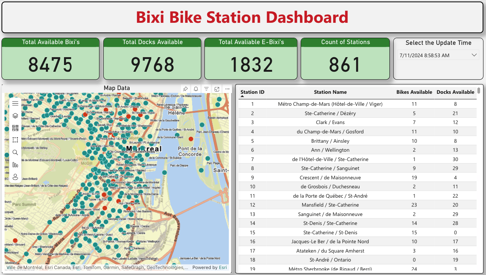

# Bixi Live GBFS Feed Data Analytics
This project involves the end-to-end development of a data engineering pipeline using the Bixi Live GBFS feed. The objective was to ingest, process, and transform real-time data about bike-sharing stations in Montreal to facilitate dynamic data analysis and visualization. Using Azure Data Factory and Azure Databricks, the project successfully ingested JSON formatted data about station information and status, transformed and cleaned this data, and stored the refined datasets in Azure Data Lake. The processed data was then used to create an interactive dashboard in Power BI, providing insights into station operations and mappped data.

### Objectives
- **Data Ingestion**: Automate the extraction of real-time data from the Bixi Live GBFS feed using Azure Data Factory.
- **Data Processing and Transformation**: Utilize Azure Databricks to cleanse and merge datasets for accurate analysis.
- **Data Visualization**: Develop a Power BI dashboard to visualize key metrics and provide actionable insights into bike station statuses and usage.
- **Automation and Monitoring**: Implement automated data updates and monitoring to ensure the continuous availability of updated and accurate data.
- **Strategic Decision Making**: Enable stakeholders to make informed decisions based on real-time data analytics.

This project aims to enhance operational efficiencies and user experiences by leveraging advanced cloud technologies and business intelligence tools.

## 1. Data Ingestion Process

### Creating Linked Services in Azure Data Factory
- Configured HTTP linked services to connect to the Bixi Live GBFS Feed URLs.
- Defined two linked services: one for station information and another for station status.

### Pipeline Creation in Azure Data Factory
- Designed a data pipeline to automate the ingestion process.

#### Activities in the Pipeline:
- **HTTP Connector Activity**: Set up to fetch data from the station information URL and the station status URL.
- **Copy Activity**: Configured to copy the fetched data into JSON datasets.

### Data Storage in Azure Data Lake
- Defined datasets in Azure Data Lake to store the JSON data.
- Stored the station information and station status data in their respective JSON datasets.

### Scheduling and Monitoring
- Scheduled the pipeline to run at regular intervals to ensure the datasets are updated with the latest information.
- Set up a trigger to run every 5 minutes, updating the files with new data from the Bixi Live GBFS feed.
- Monitored the pipeline for successful execution and handled any errors or issues during the data ingestion process.

## 2. Data Cleaning and Transformation Process

### Mounting Azure Storage in Databricks
- Mounted the Azure Blob Storage in Databricks using the `wasbs` scheme.
- Configured Spark to access the storage account using the account key.

### Loading Data
- Loaded the JSON data from Azure Data Lake into Databricks for processing.
- Data sources included paths to station information and station status JSON files in Azure Data Lake.

### Data Parsing and Transformation
- Parsed JSON data to extract relevant fields and transformed it to a structured format.
- Merged station information and station status datasets based on station ID to create a comprehensive view.

### Data Cleaning
- Converted Spark DataFrames to Pandas DataFrames for easier manipulation.
- Removed duplicates and cleaned the data to ensure consistency.

### Storing Transformed Data
- Converted the cleaned data to a CSV format and stored it back in Azure Data Lake.
- Ensured that existing data was appended with new data correctly and duplicates were removed before saving.

## 3. Data Analysis in Azure Synapse Analytics

### Exploratory Data Analysis (EDA)
- Conducted Exploratory Data Analysis (EDA) using Azure Synapse Analytics to understand the distribution and characteristics of the data.
- Utilized SQL queries to derive meaningful insights from the cleaned and transformed data stored in Azure Data Lake.

### Summary Statistics for Numerical Columns
- Calculated summary statistics for the latest snapshot of the data from the `bixi_station_data` table. 
- This included determining the minimum, maximum, and average values for key numerical columns such as the number of bikes available, e-bikes available, and docks available.
- These statistics provided a comprehensive overview of the bike and dock availability across different stations.

### Analyzing the Distribution of Available Bikes and Docks
- Analyzed the distribution of available bikes and docks to identify patterns and trends.
- Grouped the data by the number of bikes available and the number of docks available to see how they were distributed across different stations.
- This analysis helped in understanding the frequency and spread of bike and dock availability, which is crucial for operational and logistical planning.

### Key Findings
- The summary statistics revealed the range and average availability of bikes and docks at various stations.
- The distribution analysis highlighted stations with the highest and lowest availability, indicating potential areas for improvement in bike distribution and dock management.

## 4. Power BI Dashboard

### Dashboard Overview
The Power BI dashboard provides a dynamic and interactive visualization of the Bixi bike station data. It includes key metrics and detailed insights into the current status of bike-sharing stations in Montreal. The dashboard facilitates real-time monitoring and helps stakeholders make informed decisions based on up-to-date data with an option to select the view based on the update time.

### Key Features
- **Total Available Bikes**: Displays the total number of bikes available across all stations.
- **Total Docks Available**: Shows the total number of docks available for bike returns.
- **Total Available E-Bikes**: Indicates the total number of electric bikes available.
- **Count of Stations**: The total number of active bike stations.
- **Map Data**: An interactive map showing the geographical distribution of bike stations, color-coded by the availability of bikes and docks.
- **Station-Level Table**: A detailed table listing each station’s ID, name, number of available bikes, and number of available docks.
